
<h1 align="center">基于BS架构的法律咨询系统的分析与设计+vue</h1>

## 简介
本系统融合BS架构与Vue技术，集成法律信息查询、法律咨询管理、用户中心、论坛和公告管理功能，提供简洁明了的界面设计，支持有效的法律服务访问与交互。    --计算机毕业设计源码；毕设源码；java毕业设计源码

## 联系方式

<h3 align="center">获取完整代码与数据库文件 + 微信：deepguan QQ: 86050149 QQ群: 783742310</h3>

<h3 align="center">可帮忙远程部署 包运行成功！提供远程部署、修改代码、设计文档指导、代码讲解等服务！</h3>

## 功能介绍（完整见运行截图）
管理员：管理员可以访问和管理系统的各个功能模块, 包括个人中心、法律咨询管理、法律信息管理、公告信息管理、论坛管理、用户管理和后台数据管理。管理员有权查看、编辑和删除法规、公告、帖子等信息，并能回复或处理用户的法律咨询。此外，管理员还负责用户及权限的配置，并提供系统的运维支持。用户登录后，管理员身份会显示在界面顶部，支持快速注销和退出功能。

用户：用户可以通过主导航栏访问首页、法规信息、论坛、公告信息和个人中心等模块。用户能够查阅和搜索法律法规信息，参与论坛讨论，查看公告，并提出法律咨询。个人中心为用户提供查看和编辑个人信息的功能，如用户名、联系方式、邮箱等，还支持头像上传。用户可以通过法律咨询模块输入问题并获取法律建议，并能收藏和查找法律资讯以获得个性化的服务和支持。

## 运行截图
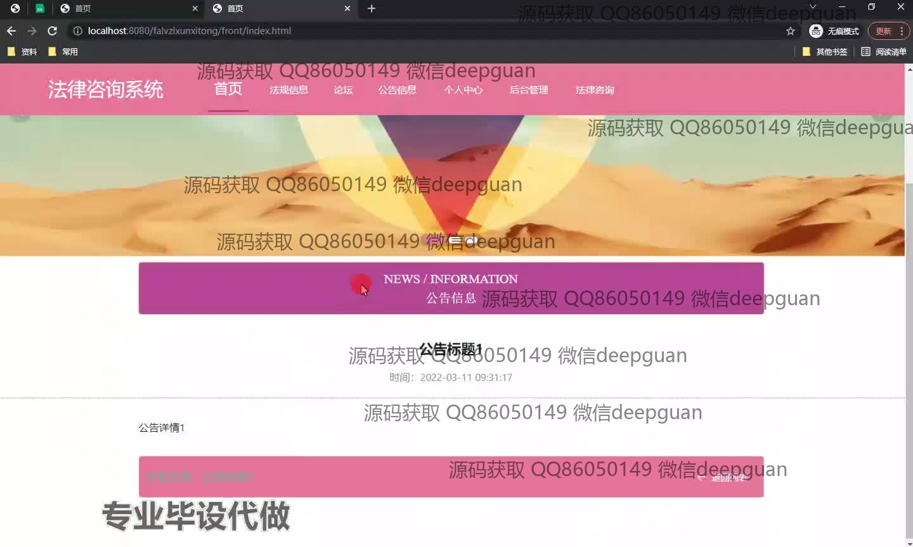
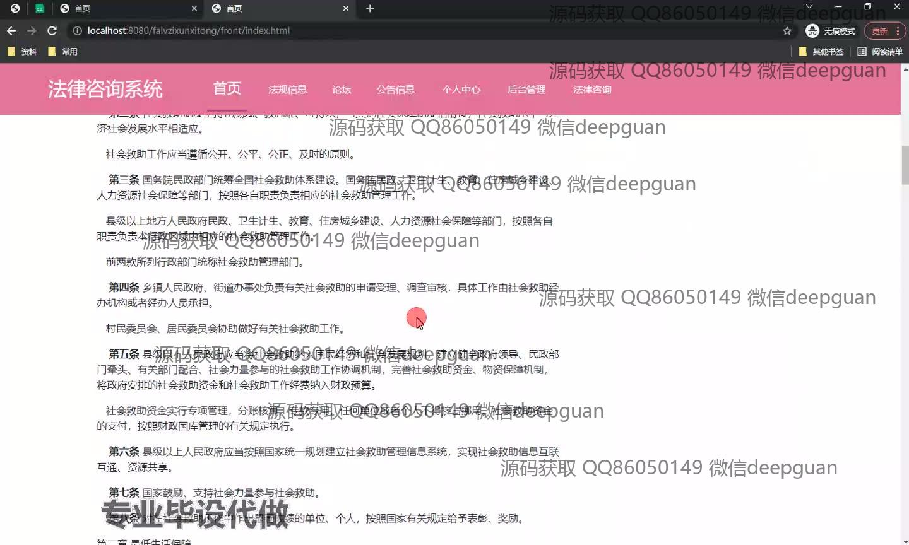
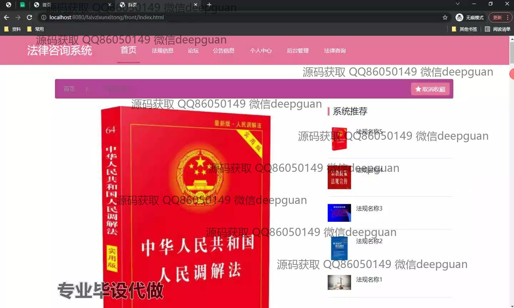
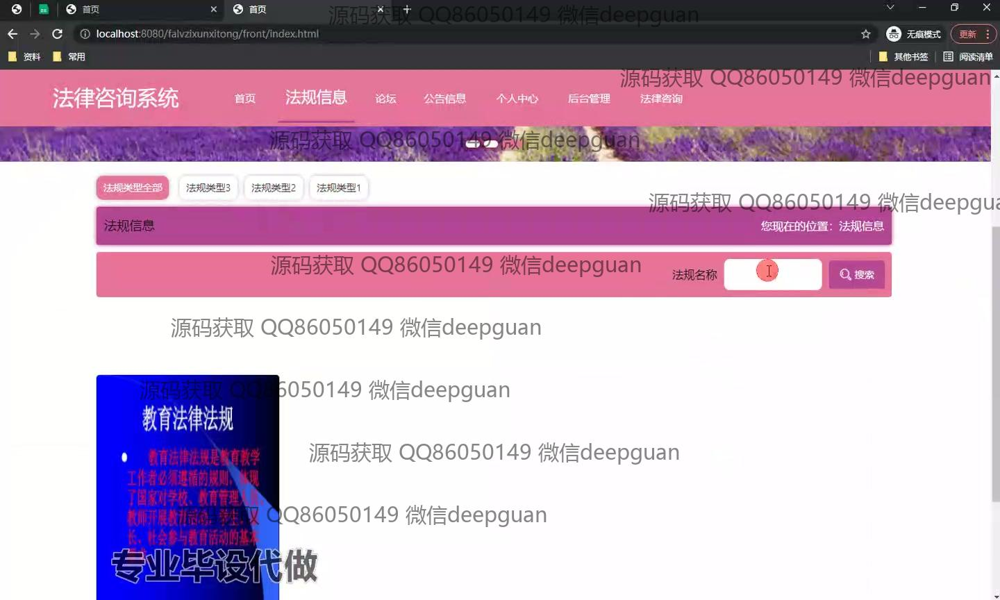
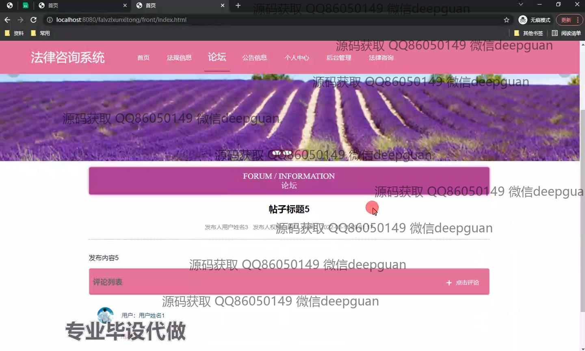
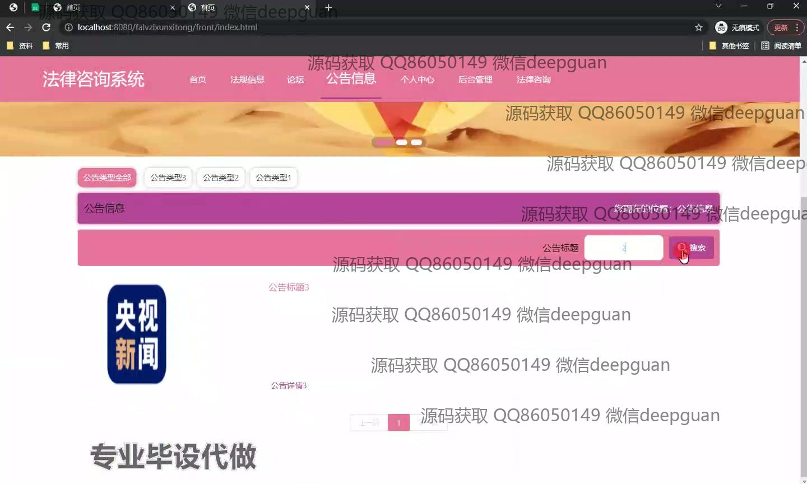
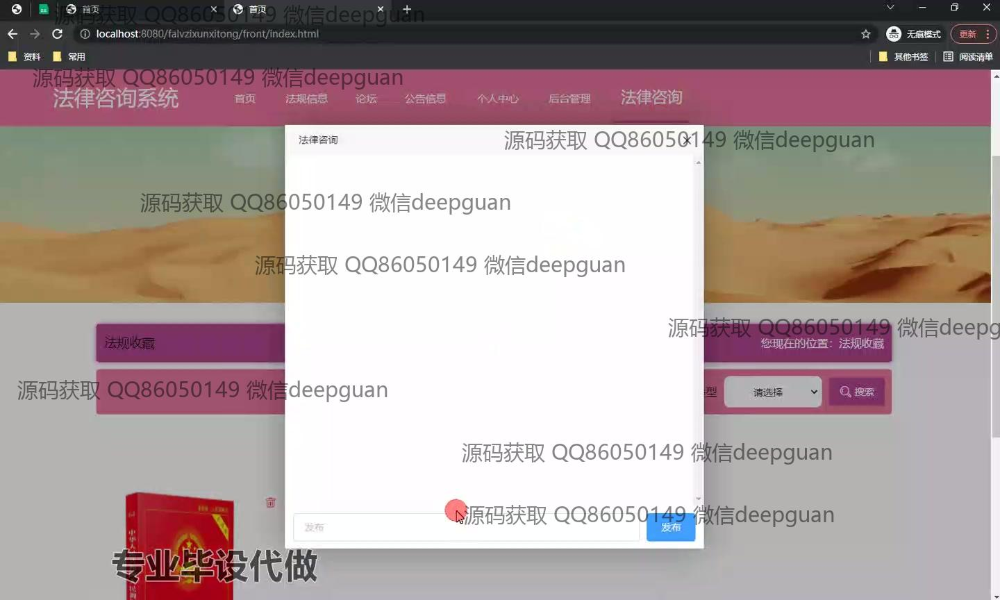
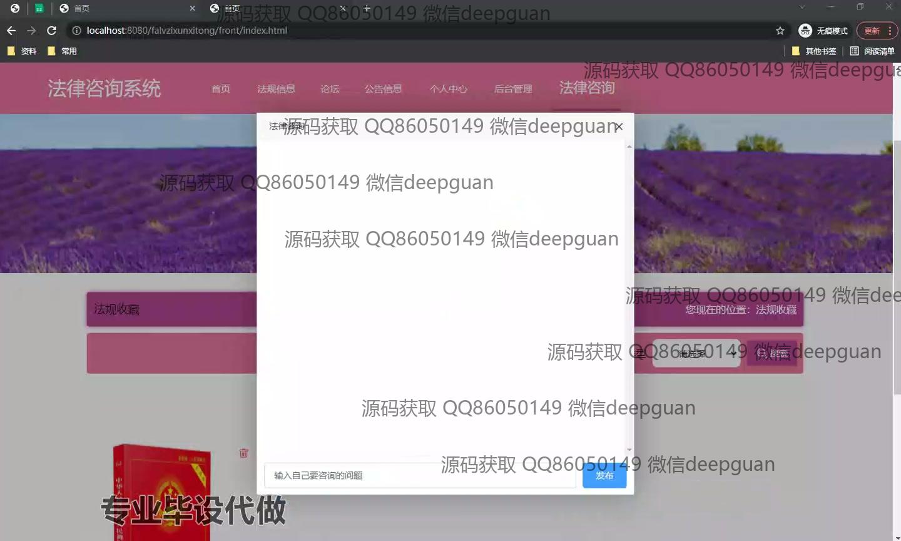
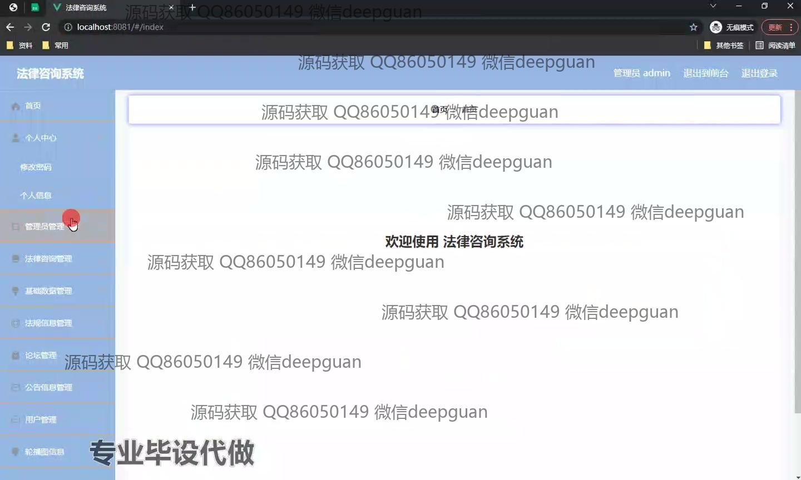
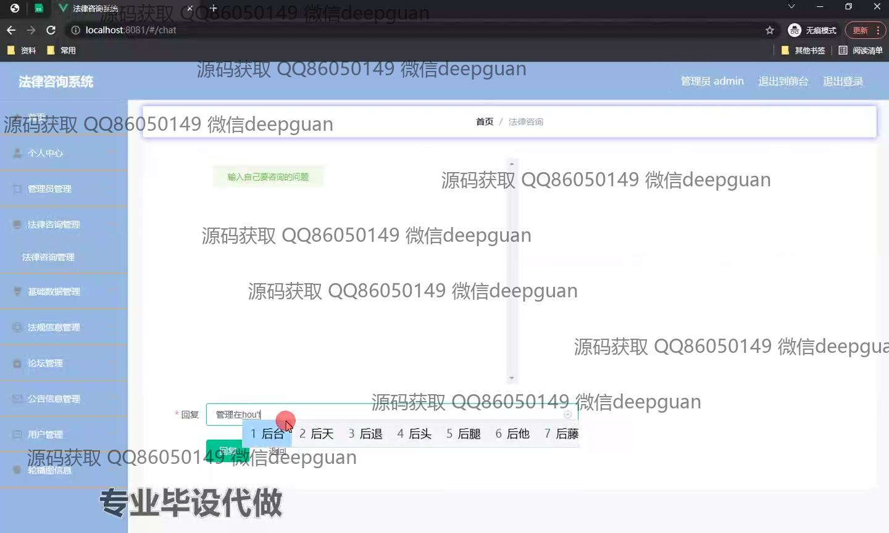
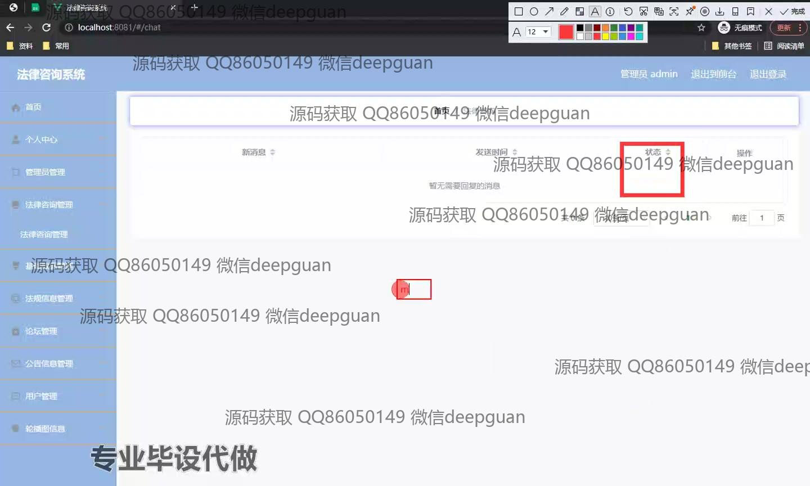
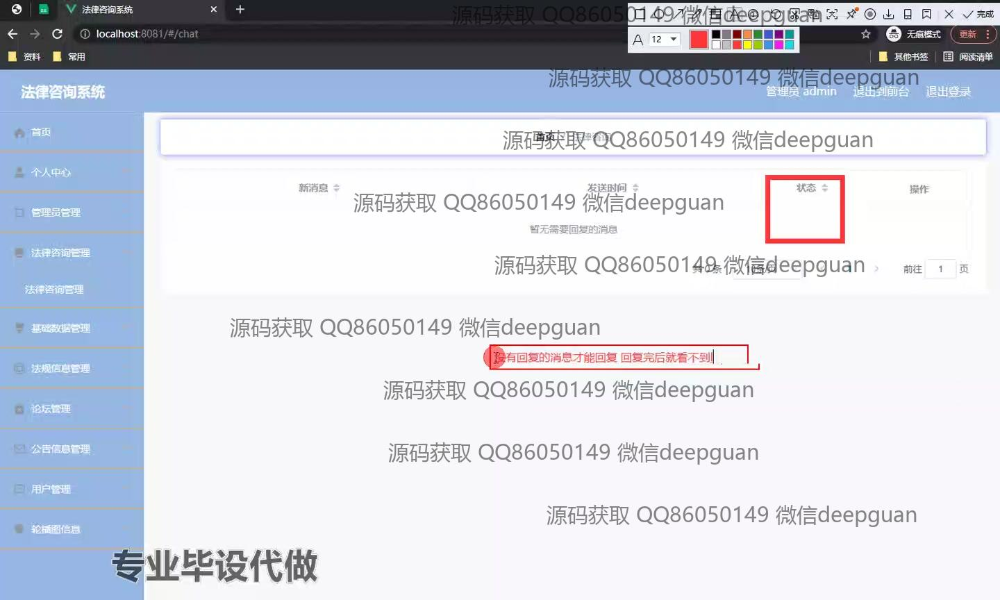
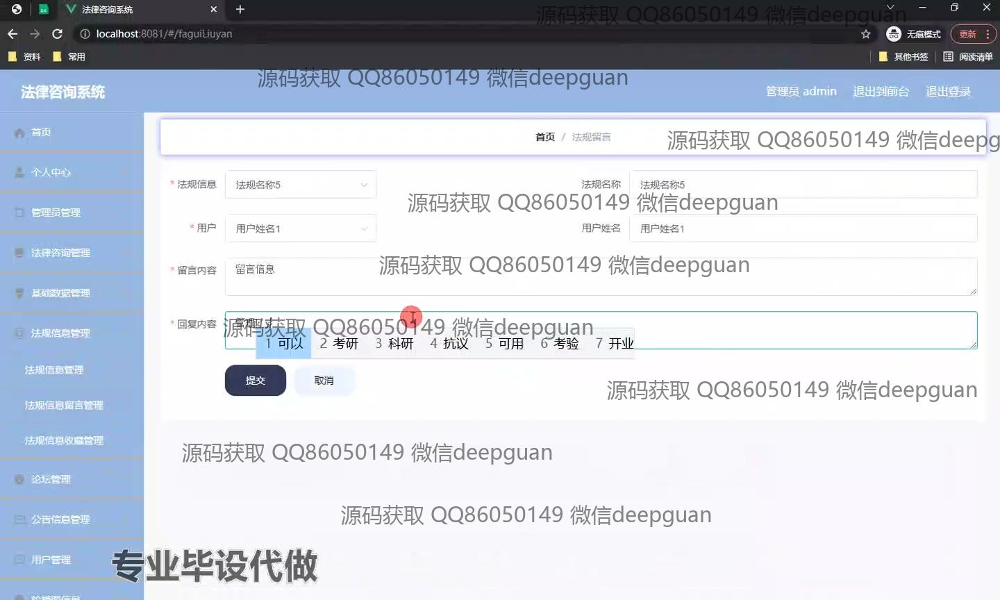
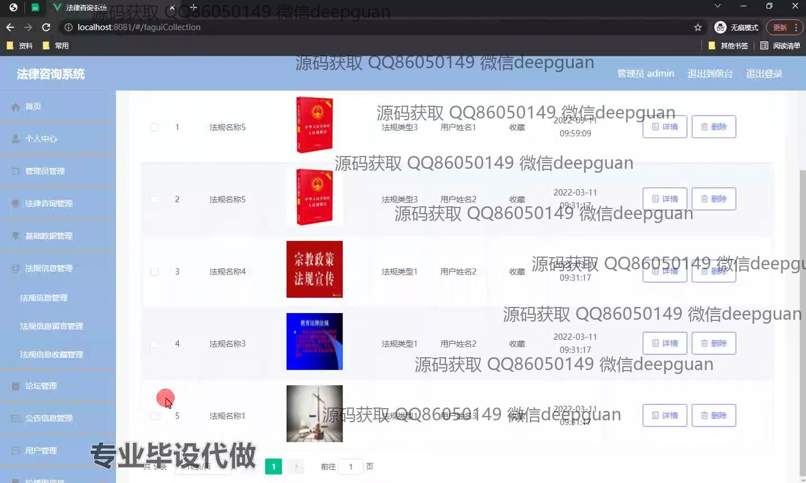
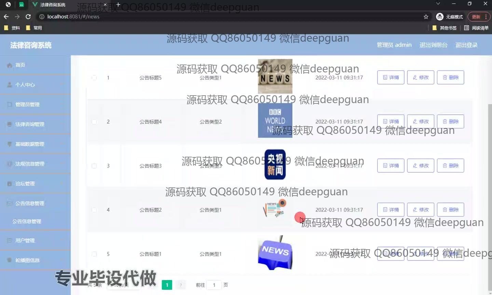
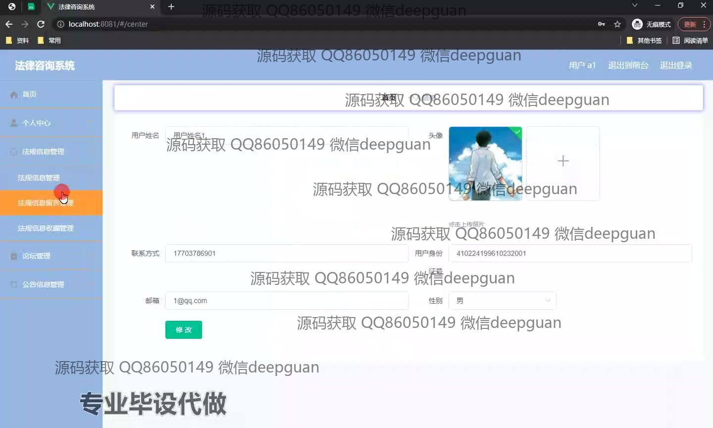
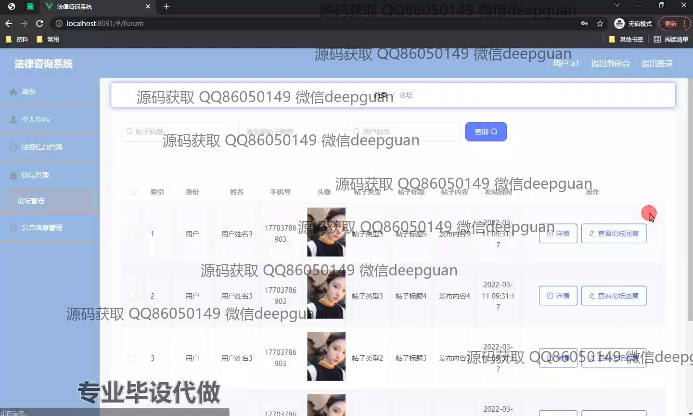

本代码来源于网络,仅供学习参考使用!

